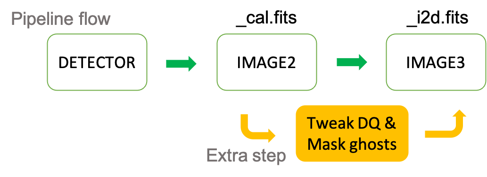
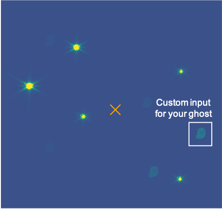

Ghost detection tool for JWST NIRISS data
=========================================

Author: Takahiro Morishita

.. image:: ./figure/demo.png

Purpose
-------

NIRISS WFSS and direct imaging modes are known to produce optical ghosts when there are bright sources in the observed field of view, as summarized `here <https://jwst-docs.stsci.edu/near-infrared-imager-and-slitless-spectrograph/niriss-instrumentation/niriss-gr150-grisms#NIRISSGR150Grisms-Ghosts>`__.
Users are advised to apply this code to final NIRISS images, so that they can avoid confusing real sources with optical ghosts in their final products.

By providing _cal.fits image (IMAGE2 product) and source catalog to this script, you can:

- identify possible ghost in the input image
- get a source catalog with a new flag column, ``is_this_ghost``.
- Turn DQ arrays of the pixles of the detected ghosts to ``DO_NOT_USE``, so IMAGE3 pipeline ignores these pixels.

    *How this works. Ghost detection, and then DQ tweaking here, can be applied to IMAGE2 products 
    before these go into the IMAGE3 step.*

Installation
------------

.. code-block:: bash

    python setup.py install

Usage
-----

Ghost detection in a calibrated image (i.e. _cal.fits from the JWST pipeline). See ./example/Photometry_IMAGE2_product.ipynb for how to get photometry catalog and segmentation map on _cal.fits.

.. code-block:: bash

    python detect_ghost_image2.py [image] [catalog]

or in your python script;

.. code-block:: bash

    from niriss_ghost import detect_ghost_image2
    detect_ghost_image2.run(list-of-image, list-of-catalog)

Optional arguments:

- --rlim: Search radius from the predicted coordinates of a ghost, in pixel.
- --frac_ghost: Fraction flux of a ghost compared to the source.
- --o: Output directory. Default is set to the working directory.
- --f_mirage: Is the input image created by Mirage? If not (i.e. on-sky data), set this False.
- --keyword_flux: Column name for flux in ``catalog``. Default is source_sum (one that comes with photutils.).
- --f_tweak_dq: Change DQ arrays of the positions of the detected ghosts. You need the segmentation map of the provided catalog (_seg.fits).
- --segmap: Segmentation map of the provided catalog, if f_tweak_dq==True. (Default: image.replace('.fits', '_seg.fits'))
 
Determine ghost axis point (GAP) coordinates based on a calibrated image.

.. code-block:: bash

    python get_gap.py [image] [catalog]

or in your python script;

    .. code-block:: bash
    
        from niriss_ghost import get_gap
        get_gap.run(list-of-image, list-of-catalog)

Optional arguments:

- --nmc: Number of MCMC iterations (3000 default).
- --nwalkers: Number of walkers (20 default).
- --check_flux: Use flux ratio for posterior calculation (True default).

Appendix: Simulation of ghosts in a NIRISS scene
------------------------------------------------

Ghost simulation module has been implemented in Mirage. Take a look at the documentation `here <https://mirage-data-simulator.readthedocs.io/en/latest/ghosts.html>`__.

An example notebook is also available from this repository, which demonstrates a case with a custom input file for ghosts.

Result with a custom fits stamp:

